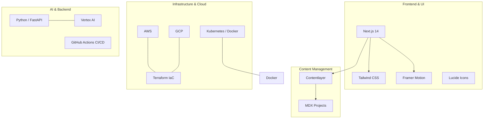

# Ikenna Anasieze | Cloud & AI Engineer Portfolio

A sleek, modern, and high-performance portfolio website built with **Next.js**, **Tailwind CSS**, and **Contentlayer**. This site showcases my work as a **Cloud & AI Engineer** based in Ontario, Canada, currently working at **Vosyn** (Jan 2025 - Present).

## 🚀 Professional Profile

**Cloud & AI Engineer** specialized in:
- Multi-cloud Infrastructure (AWS, Azure, GCP)
- Infrastructure as Code (Terraform, CloudFormation)
- CI/CD Automation (Reduced deployment times by 75%)
- Serverless Architectures (Lambda, Step Functions, EventBridge)
- Data & AI (BigQuery, Vertex AI, Python, FastAPI)

## 🏗️ Architecture & Tech Stack



## 🛠️ Tech Stack Details

- **Framework:** [Next.js](https://nextjs.org/) (App Router)
- **Styling:** [Tailwind CSS](https://tailwindcss.com/)
- **Content:** [Contentlayer](https://www.contentlayer.dev/) with MDX
- **Animations:** [Framer Motion](https://www.framer.com/motion/)
- **Deployment:** [Vercel](https://vercel.com/)
- **Icons:** [Lucide React](https://lucide.dev/)

## 📂 Project Highlights

1.  **Disaster Recovery Architecture**: High availability and failover design on AWS.
2.  **Event-Driven Cloud System**: Asynchronous workflows using EventBridge and Cloud Functions.
3.  **Microservice Architecture for AI Workloads**: Scalable containerized services for AI model serving.

## 📧 Contact
- **Email:** ikenna.anasieze@gmail.com
- **LinkedIn:** [ikenna-anasieze](https://www.linkedin.com/in/ikenna-anasieze/)
- **GitHub:** [Donaldnaz](https://github.com/Donaldnaz)

## 🏃 Running Locally

### Prerequisites
- Node.js (Latest LTS)
- pnpm (`npm install -g pnpm`)

### Installation
```bash
pnpm install
```

### Development
```bash
pnpm dev
```
Open [http://localhost:3000](http://localhost:3000) to view the result.

## 📄 License
This project is licensed under the MIT License.
